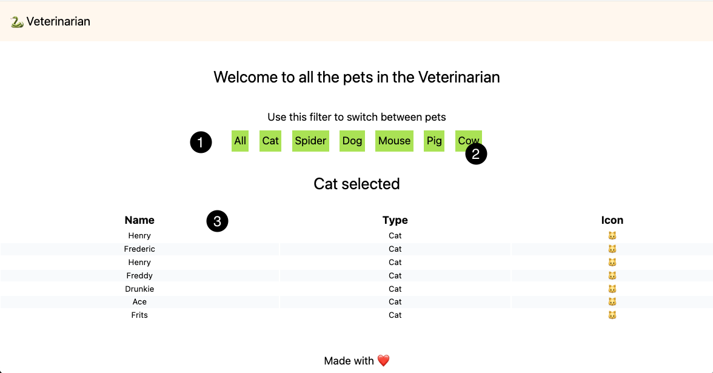

# Exam in English

### Description

---

In this repository you can find two programs:

- Program 1 - a frontend in Svelte connected to program 2
- Program 2 - a backend Pets micro services

The Pet micro service implemented the following routes.

| Method | Route | Description |
| --- | --- | --- |
| GET | /pets | Gives all the pets in the system |
| GET | /pets/:id | Give a specific pet |

The frontend fetches data from the backend and displays it.

---

### Assignment - Frontend (15 points)

---

Start with this assignment! For this assignment you need both the frontend as well as the backend.

**Some Basic Principles**

1. You are not allowed to modify the backend.
2. You don't have to implement the design pixelperfect. The functionality is more important.

Given the above image; this is what it should ultimately look like.

1. (5 points). On the main page, retrieve the data of all pets via a server request to `/pets` and display these records in the given table as shown in the example figure on icon number 3.
2. (5 points). Pass the data from the fetch in step 1 to the `<Pets />` component.
3. (5 points). In `Pets`, all individual animal types are passed to the `<Filter>` component (icon number 1). In `Filter`, you can click (icon number 2) on an item. When this item is clicked, only those animals are shown in the overview. You use reactivity here by means of the Context API in SvelteKit.

Your code will be tested using Firefox.

### Assignment - Backend (15 points)

---
For this assignment you will only need the backend micro service

1. Fix (see the one fixme and one todo comment in the function) and use (add the proper route) the updatePet function in the petsController.
   The function should at least update de name of the pet given an existing id and provide a proper error message if the id does noet exist. (3 points)
2. Add and implement a route that finds all Spiders and returns the ids. (3 points)
3. Add and implement a route that deletes multiple pets given a list of ids. (3 points)
4. Make sure all return codes are correct and that all new functionality provides error messages if needed. (3 points) 
5. Add, implement and use a new middleware function that logs the hostname of the client. (3 points)

At all times the data model must remain in a consistent state. This includes restart of the backend microservice. Also, the location of added functionality in the code is important. A maximum of 5 points will be subtracted if the added code is not placed in the most logical sections (i.e., controller, middleware, router) of the given codebase and/or if the data model becomes inconsistent after a restart.  

Your backend code will be tested via postman.  